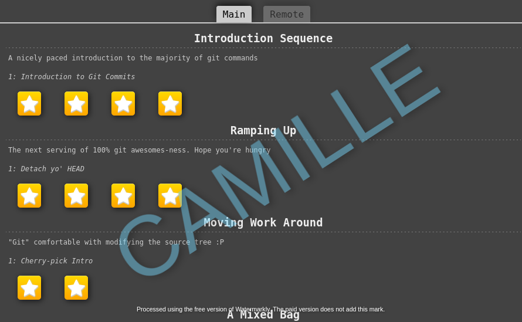
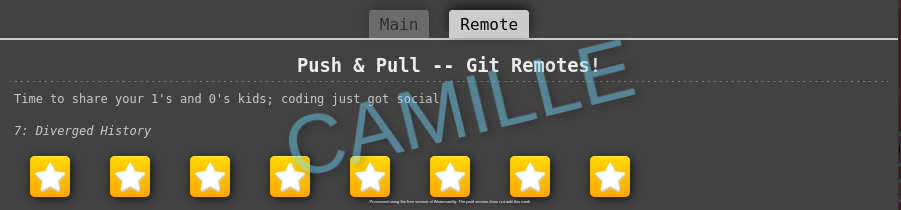
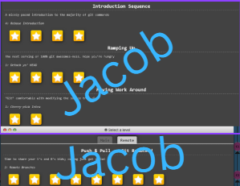

# Homework 2 Repository

## 📝 Introduction

### Badges


### Description

This repository is for CSC 510's HW2. The purpose is to show our groups proficiency with Git.

## Screenshots







## Code Examples

```sh
# Stage all changes for commit
git add .


# Commit the staged changes with a message
git commit -m "Add changes"


# Push to the remote repository
git push origin YOUR_BRANCH
```

## Task List

- [x] Task 1: Add Badges
- [x] Task 2: Create simple HTML page
- [x] Task 3: Create individual Branches
- [x] Task 4: Create and Assign Issues
- [x] Task 5: Complete Git Tutorial
- [x] Task 6: Add Screenshots to `README.md`
- [x] Task 7: Modify `.html` File
- [x] Task 8: Merge latest changes
- [x] Task 9: Review pull requests
