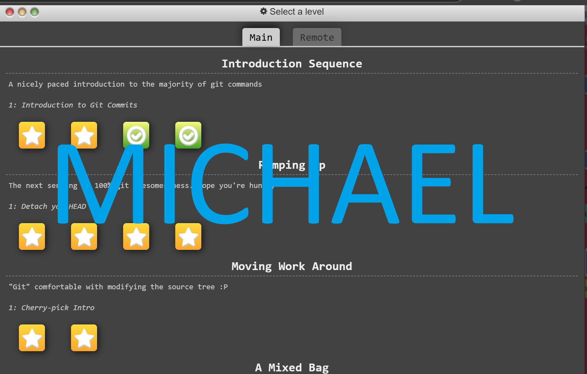
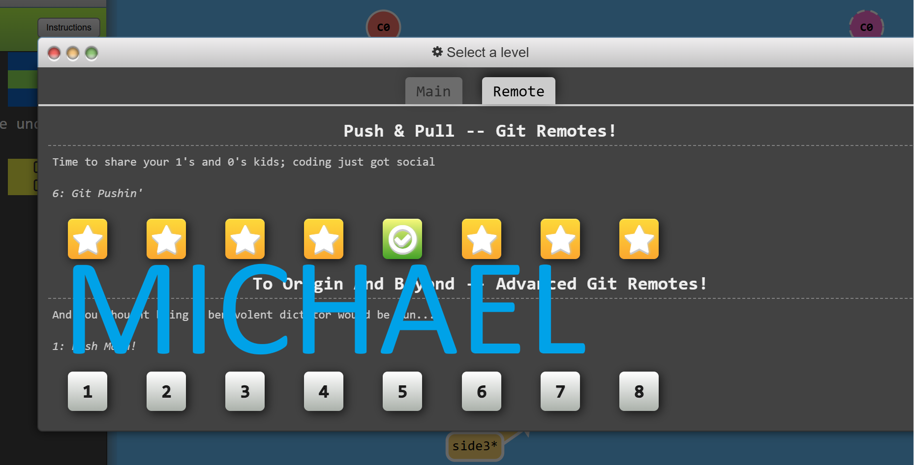

## Homework 2 Repository

#### Badges


#### Description

This repository is for CSC 510's HW2. The purpose is to show our groups proficiency with Git.

### Task List

- [x] Task 1: Add Badges
- [x] Task 2: Create simple HTML page
- [ ] Task 3: Create individual Branches
- [ ] Task 4: Create and Assign Issues
- [ ] Task 5: Complete individual issues
- [ ] Task 6: Comeplete Issue 5.

### Screenshots




### Code Examples

```
# Stage all changes for commit
git add .
```
